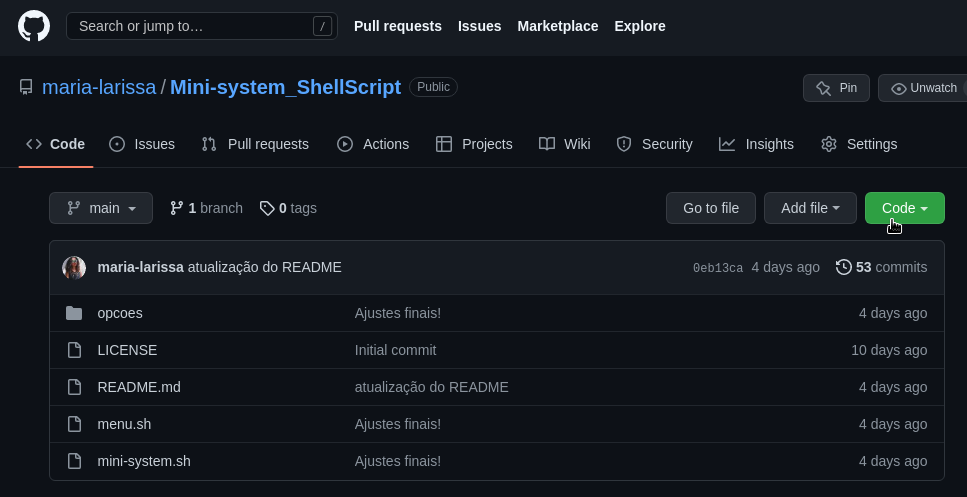
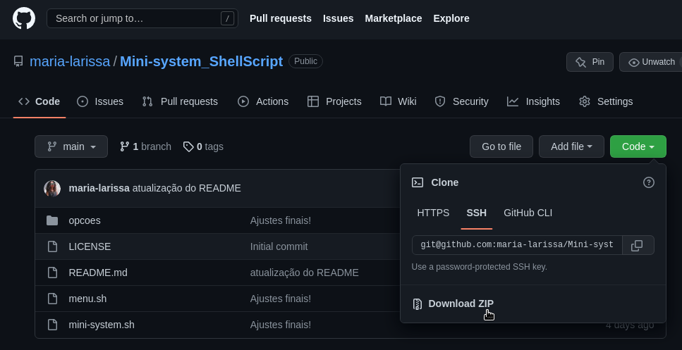

# Mini-sistema feito com Shell Script

O programa consiste em um mini-sistema onde são apresentadas varias opções para o usuário em forma de menu, essas opções são questões de uma lista confecciona na diciplina de Laboratório de programação do curso de Matemática Computacional da Universidade Federal do Cariri.

##### **Caso o nosso projeto seja útil de alguma forma para você, deixe uma estrela!**


#### **Rules**
* O sistema deve ser LINUX.
* É necessário ter o zenity instalado. Por padrão, o zenity já vem instalado em algumas distribuições, caso não o tenha instalado recomendo esse [tutorial](https://howtoinstall.co/en/zenity). Mas você pode pesquisar como instala-lo na sua distribuição.
* A lingua dominante no computador deve ser português(pt) ou inglês(en).


#### **Instruction**
* Baixar e descompactar a pasta.zip "Mini-system_ShellScript" seguindo o passo a passo abaixo;
  1. Ao abrir o repositorio, clique no botão "code"
  
  
  2. Baixe a pasta zipada.
  
* Descompacte a pasta "Mini-system_ShellScript" e abra pelo CMD/prompt de comando.
* Executar somente o arquivo "mini-system.sh", através do comando

```
bash mini-system.sh.
```

#### **Tecnology**
 * GNU bash - Version 5.1.16(1)-release
 * GNU bash - Version 5.1.4(1)-release


#### **Text editor**
* Gedit - Version 42.2
* Nano - Version 5.4


## Authors

 [@Maria Larissa](https://github.com/maria-larissa)
 e-mail: maria.larissa@aluno.ufca.edu.br
 
 
 [@Nazareno Mateus](https://github.com/nazamath)
 e-mail: nazareno.mateus@aluno.ufca.edu.br 


 Prof. orientador [@Ramon Nepomuceno](https://github.com/ramonn76)
 e-mail: ramon.nepomuceno@ufca.edu.br  
